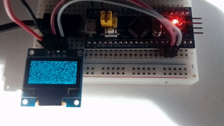

# White noise

Based on an example from https://github.com/jamwaffles/ssd1306

Send random raw data to the display, emulating an old untuned TV.

Code for "blue pill" STM32F103C8T6 board.

_Check branches for ports to other boards:_

* _STM32F030F4P6:_
* _STM32F411CEU6 "black pill"_
* _STM32F407VET6 with hardware Random Numbers Generator_

Uses SmallRng as random number generator. 

Note: these are pseudorandom numbers, not suitable for cryptographic or similar purposes.